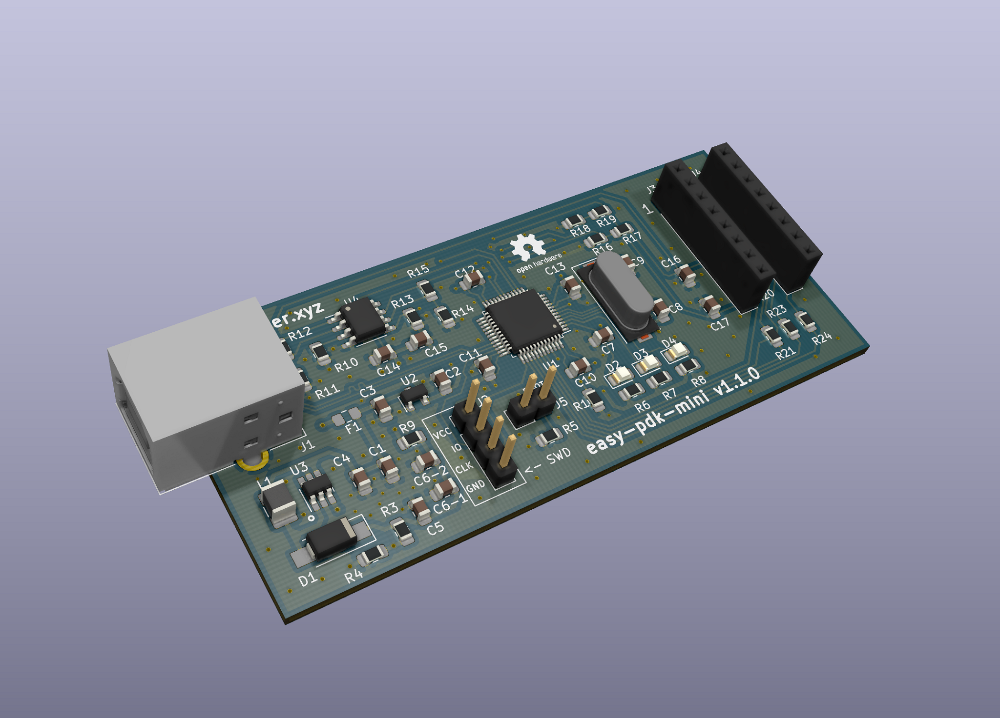
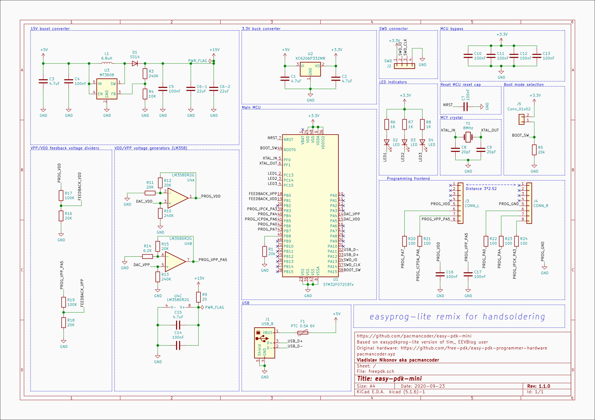

# easy-pdk-mini

Easy PDK mini is the programmer hardware variant originated from
[easy-pdk-programmer-hardware](https://github.com/free-pdk/easy-pdk-programmer-hardware) project.

**WARNING: This design was not tested yet! Use only on your own risk!**

Schematics was simplified and the "lite" version of the programmer by *tim_* was used as a base for
this project, so in difference with the original hardware, this version works without MOSFET boost
converter enable switch and negative voltage charge pump for the opamp.

### Hand soldering
All passives have at least 0805 size, and the mini-USB port was used instead of micro-USB, so it
should be relatively easy to solder this programmer by the hand. The only quirky parts which may be
hard to solder is STM32 MCU and MT3608 boost converter so be sure to solder them first. 

### Changes
Although existing "lite" version of easy-pdk-programmer (which was used as a reference for this
project) is relatively simple by itself, some additional simplifications was made:
- Removed 20Ohm USB series resistors. According to STM32F072 datasheet: *"No external termination
series resistors are required on USB_DP (D+) and USB_DM (D-); the matching impedance is already
included in the embedded driver"*
- Replaced boot button with simple jumper
- Replaced 47uF boost converter output capacitor with two 22uF caps to simplify process of finding
components (In my city I was not able to find 47uF 16v, while it was easy to find 22uF 25V)
- Added pull-down resistor for PB8 to make programmer detect as "lite" hardware 

### Schematics

### PCB

